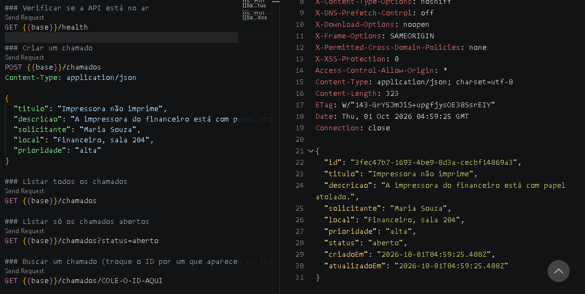

# HelpDesk API

API REST para gestão de chamados de suporte técnico (TI), feita com **Node.js**, **Express**, **TypeScript** e **PostgreSQL**, rodando em **Docker**.

É o back-end do [HelpDesk Mobile](https://github.com/JoaoVictor852529/helpdesk-mobile-v2) — o app em React Native que consome esta API.

## Funcionalidades

- CRUD de chamados (criar, listar, buscar, atualizar status e excluir)
- Filtro de chamados por status
- Validação de todos os dados de entrada com Zod, com mensagens de erro claras
- Tratamento centralizado de erros com os códigos HTTP corretos (400, 404, 500)
- Ambiente completo (API + banco) com um único comando via Docker Compose

## Segurança

- **Consultas parametrizadas** no PostgreSQL, prevenindo SQL Injection
- **Validação de entrada** em todas as rotas (tipos, tamanhos e valores permitidos)
- **Helmet** para cabeçalhos HTTP de segurança
- Limite de tamanho no corpo das requisições
- Erros internos não expõem detalhes do sistema ao cliente
- Container da API roda com usuário sem privilégios de administrador

## Tecnologias

Node.js · Express 5 · TypeScript · PostgreSQL · Zod · Docker · Docker Compose

## Rotas

| Método | Rota | Descrição |
|---|---|---|
| GET | `/health` | Verifica se a API e o banco estão no ar |
| GET | `/chamados` | Lista os chamados (filtro opcional `?status=aberto`) |
| GET | `/chamados/:id` | Busca um chamado |
| POST | `/chamados` | Cria um chamado |
| PATCH | `/chamados/:id/status` | Atualiza o status |
| DELETE | `/chamados/:id` | Exclui um chamado |

Exemplo de criação:

```json
POST /chamados
{
  "titulo": "Impressora não imprime",
  "descricao": "Papel atolado na impressora do financeiro.",
  "solicitante": "Maria Souza",
  "local": "Financeiro, sala 204",
  "prioridade": "alta"
}
```

## Testando a API

Criação de um chamado pelo REST Client do VS Code. Repare nos cabeçalhos de segurança adicionados pelo Helmet e no chamado salvo no PostgreSQL:



## Estrutura

```
src/
├── server.ts                  # Inicia o servidor
├── app.ts                     # Configura o Express (middlewares e rotas)
├── config/env.ts              # Lê e valida as variáveis de ambiente
├── database/pool.ts           # Conexão com o PostgreSQL
├── routes/                    # URLs da API
├── controllers/               # Recebe a requisição e devolve a resposta
├── schemas/                   # Validação dos dados (Zod)
├── repositories/              # Consultas SQL
├── middlewares/error-handler.ts
└── errors/app-error.ts
database/init.sql              # Criação da tabela
```

## Como rodar

**Com Docker (recomendado):**

```bash
docker compose up --build
```

A API fica disponível em `http://localhost:3333`.

**Em modo desenvolvimento** (recarrega ao salvar):

```bash
docker compose up db -d     # sobe só o banco
cp .env.example .env        # no Windows: copy .env.example .env
npm install
npm run dev
```

As requisições de exemplo estão em `requests.http` (extensão REST Client do VS Code).

## Próximos passos

- [ ] Autenticação com JWT e perfis (usuário, técnico, admin)
- [ ] Comentários nos chamados
- [ ] Testes automatizados
- [ ] Deploy na nuvem

## Autor

João Victor — [LinkedIn](https://www.linkedin.com/in/jo%C3%A3o-victor-100a12354/) · [GitHub](https://github.com/JoaoVictor852529)
